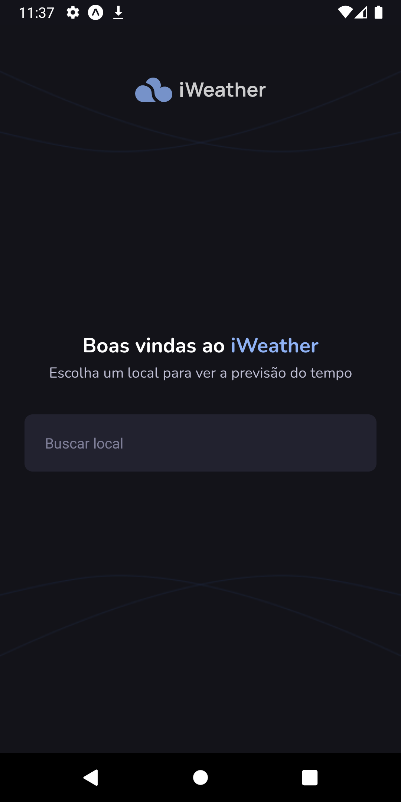
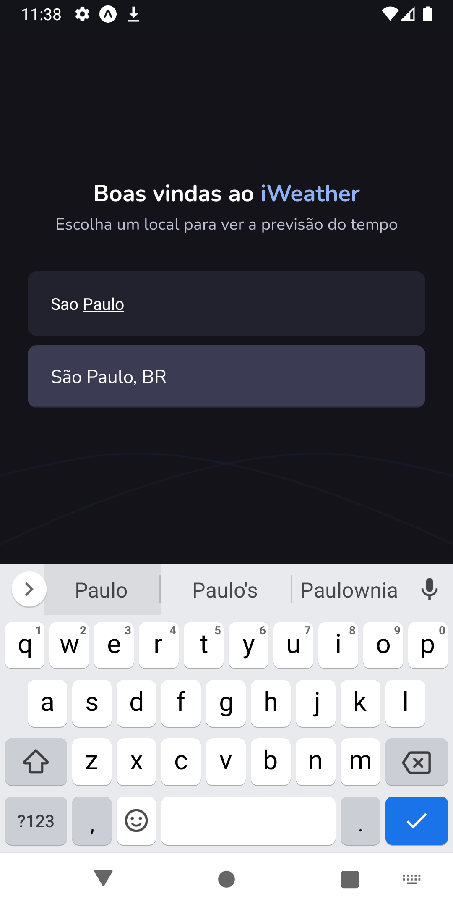
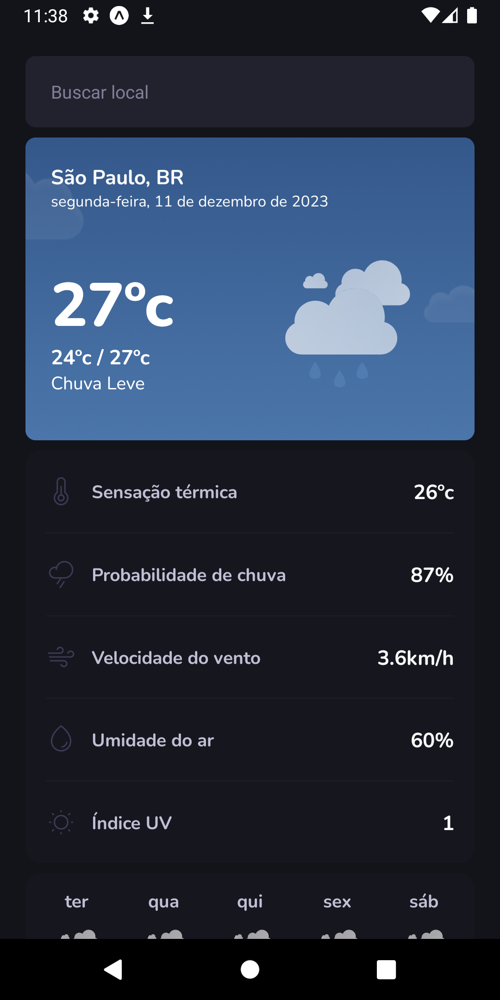
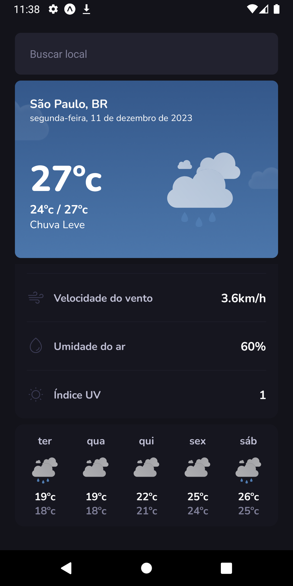

# iWeather

## O que é necessário para testar essa aplicação?

- Ter o [Node.js](https://nodejs.org/en) instalado acima da versão 18;
- Ter o gerenciador de pacotes [Yarn](https://yarnpkg.com/) instalado;
- Simuladores: [Xcode](https://developer.apple.com/xcode/) ou [Android Studio](https://developer.android.com/)

## Principais Tecnologias Utilizadas

- [React-Native](https://reactnative.dev/)
- [Expo](https://expo.dev/)
- [TypeScript](https://www.typescriptlang.org/)
- [Axios](https://axios-http.com/ptbr/docs/intro)
- [Styled-components](https://styled-components.com/)
- [React Navigation](https://reactnavigation.org/)
- [Jest](https://jestjs.io/pt-BR/)
- [React Native Testing Library](https://testing-library.com/)

## Variáveis de Ambiente

Para rodar esse projeto, você vai precisar adicionar as seguintes variáveis de ambiente no seu .env

`EXPO_PUBLIC_WEATHER_APP_ID`

## Rodando Localmente

Clone o projeto

```bash
  git clone https://github.com/flpcastro/iweather.git
```

Entre no diretório do projeto

```bash
  cd iweather
```

Instale as dependências

```bash
  yarn
```

Execute no emulador de sua preferência

```bash
  npx expo run:ios
  npx expo run:android
```

# Testes

```bash
  yarn test
```

```
iweather
├── assets/
├── ios/
├── src/
│   ├── @types/
│   ├── assets/
│   ├── components/
│   ├── contexts/
│   ├── hooks/
│   ├── libs/
│   │   └── asyncStorage/
│   │   └── dayjs/
│   ├── mocks/
│   │   └── api/
│   │   └── libs/
│   │   └── utils/
│   ├── routes/
│   ├── screens/
│   ├── services/
│   ├── styles/
│   ├── utils/
├── .env.example
├── .gitignore
├── app.json
├── App.tsx
├── babel.config.js
├── jest.config.json
├── metro.config.js
├── package.json
├── README.md
└── tsconfig.json
└── yarn.lock
```

## Documentação de cores

| Cor        | Hexadecimal                                                      |
| ---------- | ---------------------------------------------------------------- |
| White      |  #FFFFFF |
| Blue Light |  #8FB2F5 |
| Brand Mid  |  #00875F |
| Gray 100   |  #FAFAFA |
| Gray 200   |  #BFBFD4 |
| Gray 300   |  #ABABC4 |
| Gray 400   |  #7F7F98 |
| Gray 500   |  #3B3B54 |
| Gray 600   |  #22222F |
| Gray 700   |  #1C1C27 |
| Gray 800   |  #16161F |
| Gray 900   |  #13131A |

## Documentação das Fontes

| Nome   | Tipo           |
| ------ | -------------- |
| Nunito | **Extra Bold** |
| Nunito | **Bold**       |
| Nunito | Regular        |

## Screenshoots

<div align="center">
  
  
  
  
</div>
